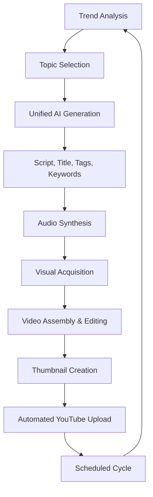

<p align="center">
  
</p>

<h1 align="center">🚀 YouTube Automation Agent</h1>

<p align="center">
  <strong>The ultimate AI-powered factory for faceless YouTube growth.</strong>
</p>

<p align="center">
  
  
  
</p>

---

## 🌟 Overview

The **YouTube Automation Agent** is a fully autonomous system designed to build and scale faceless YouTube channels 24/7. It handles everything from **niche trend analysis** and **scriptwriting** to **video editing** and **automated uploads**, all while optimizing for viral potential and high CPM.

---

## 🛠️ Tech Stack

- **Core**: Python 3.10+, FastAPI (Backend API)
- **AI Brain**: Google Gemini 1.5 Flash (Topic, Script, Metadata Generation)
- **Visuals**: Pexels API (Stock Footage), Pollinations/Flux (Image Generation), LTX-Video (AI Video Integration)
- **Audio**: Microsoft Edge TTS / ElevenLabs (Natural Voiceovers)
- **Editing**: MoviePy (Scene-based assembly, Subtitle synchronization)
- **Web UI**: Vite, Tailwind CSS (Modern status monitoring and manual control)
- **Automation**: APScheduler (Scheduling tasks)

---

## 🔄 How It Works



---

## ✨ Features

- **🎯 Hyper-Optimized SEO**: Generates high-retention titles, descriptions, and 50+ high-CPM tags.
- **⚡ Batched AI Logic**: Designed to maximize the Gemini free tier by grouping all generation tasks into a single API call.
- **👀 Attention-Grabber Hooks**: Specifically crafts the first 10 seconds of every video to skyrocket audience retention.
- **🎙️ Professional Voiceovers**: Uses state-of-the-art TTS with perfect synchronization to subtitles.
- **🖼️ Fallback Thumbnail System**: Attempts high-quality AI generation with multiple fallback layers.
- **📱 Dashboard**: Access a sleek web UI to monitor progress, view logs, and manually trigger video creation.

---

## 🚀 Getting Started

### 1. Prerequisites

Before you begin, ensure you have the following installed:
- **Python 3.10+**: [Download](https://www.python.org/downloads/)
- **Node.js & npm**: [Download](https://nodejs.org/) (Required for the Web Dashboard)
- **FFmpeg**: Essential for video/audio processing.
    - **Mac**: `brew install ffmpeg`
    - **Linux**: `sudo apt install ffmpeg`
    - **Windows**: [Download FFmpeg](https://ffmpeg.org/download.html) and add to PATH.

### 2. First Setup (Auto)

We've provided a setup script to handle the heavy lifting:

```bash
# Clone the repository
git clone https://github.com/yourusername/ytagent.git
cd ytagent

# Run the interactive setup
python setup.py
```

This script will:
- Check for prerequisites (FFmpeg, Node, etc.)
- Create your `.env` file from a template.
- Initialize required directories.
- Install all Python and Node.js dependencies.

### 3. API Key Configuration

Open the newly created `.env` file and fill in your keys. Refer to [API_KEYS_SETUP.md](API_KEYS_SETUP.md) for a detailed guide on where to get them.

**Essential Keys:**
- `GEMINI_API_KEY`: The brain behind the scripts.
- `PEXELS_API_KEY`: High-quality stock footage.
- `YOUTUBE_API_KEY`: Trend discovery.

### 4. YouTube OAuth

To enable automated uploads:
1. Go to [Google Cloud Console](https://console.cloud.google.com/).
2. Create a project and enable **YouTube Data API v3**.
3. Create OAuth 2.0 Credentials (Desktop App).
4. Download the `client_secrets.json` and place it in the project root.

---

## 🏁 Running the Agent

Launch the full stack (Frontend + Backend):

**Mac/Linux:**
```bash
./start.sh
```

**Windows:**
```batch
start.bat
```

> [!TIP]
> On the first run, keep an eye on the console as it will request OAuth authentication for YouTube access.

---

## 📁 Project Structure

- `api/`: FastAPI server for the management dashboard.
- `src/content/`: Unified AI content generation logic.
- `src/video/`: Video editing and assembly engine.
- `src/audio/`: Voiceover synthesis and SFX management.
- `src/trends/`: Trend analysis and topic discovery.
- `web/`: Modern React/Vite dashboard.

---

## 🤝 Troubleshooting

- **MoviePy/FFmpeg**: If video export fails, verify `ffmpeg` is in your system PATH.
- **Auth Issues**: If uploads fail, delete `token.pickle` and restart for fresh authentication.

---

<p align="center">Made with ❤️ for the YouTube Automation Community</p>
